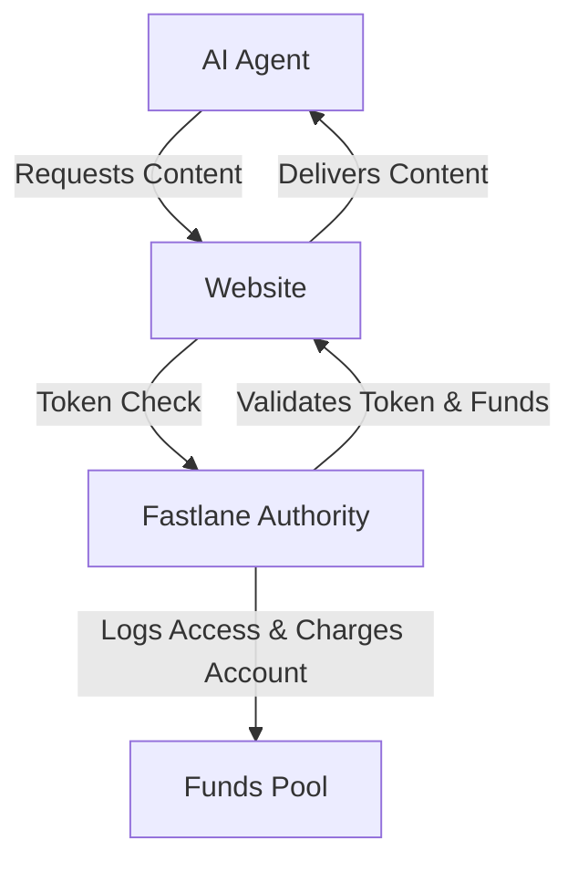

# Fastlane Worker

## Overview

**Fastlane Worker** is a system that enables AI agents to access public web content in a transparent and economically fair way. It provides a mechanism for websites to verify, meter, and monetize access by non-human agents, ensuring fairness and compliance while allowing AI agents to operate efficiently.

----
#### ⬇️ Click image for video 🎥

 [](https://www.youtube.com/watch?v=8WbO_RZ4_fo)

## Architecture



- **AI Agent**: Requests content from a website.
- **Website**: Checks the agent's token with the Fastlane Authority.
- **Fastlane Authority**: Validates the token, checks available funds, logs access, and charges the agent's account.
- **Funds Pool**: Receives payments for content access.

## Key Features

- **Token-based Access**: AI agents register and receive tokens tied to their identity and available funds.
- **Real-time Verification**: Websites verify tokens using simple algorithms.
- **Transparent Payments**: Payments are processed based on data accessed.
- **Logging**: All transactions and data accesses are logged for transparency and compliance.
- **Configurable Access Control**: Websites can define which agents can access what content and under what terms.

## Getting Started

### Prerequisites

- Node.js (v18+ recommended)
- npm or yarn
- (highly recommended) Wrangler CLI for Cloudflare Workers

### Installation

```sh
npm install
```

### Environment Variables

Create a `.dev.vars` file in the project root to store your secrets and environment variables for local development. This file is used by Wrangler and other tools to inject secrets into your worker during development.

Example `.dev.vars`:

```
# Fastlane Worker secrets
TURNSTILE_SECRET_KEY=your-secret-key-here
```

Replace `your-secret-key-here` with your actual secret key. You may need to add additional secrets as your configuration requires.

### Database Setup

1. Create the database using Wrangler:

   ```sh
   npx wrangler d1 create <DATABASE_NAME>
   ```

   Replace `<DATABASE_NAME>` with your desired database name.

2. Apply the schema and insert initial data:
   ```sh
   npx wrangler d1 execute <DATABASE_NAME> --file=createdb.sql
   npx wrangler d1 execute <DATABASE_NAME> --file=insert_data.sql
   ```

### Development

- Main entry point: `src/index.ts`
- Utility functions: `src/utils.ts`
- Page handlers: `src/pages/`
- HTML templates: `public/`

### Running Locally

If using Cloudflare Workers:

```sh
npx wrangler dev
```

Or run your preferred local server setup.

### Configuration

- `worker-configuration.d.ts`: Type definitions for worker configuration.
- `wrangler.jsonc`: Wrangler configuration for deployment.

## Usage

- Register AI agents and issue tokens.
- Integrate Fastlane token checks into your website.
- Monitor logs and funds via the Fastlane Authority.

## Contributing

1. Fork the repository.
2. Create a feature branch.
3. Submit a pull request with a clear description.

## License

LICENSE.md
